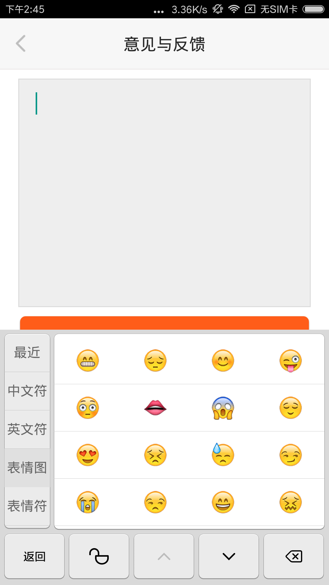

# Android_technology

> -  在一个月高风黑的晚上，一个素未谋面的大侠说：“探探”app甚好，每每看到大神作品 致敬经典，心怀崇拜之情，然后在四下无人的时候，注册了账号，开始尝试写写东西。

<table>
    <tr>
        <td><font size="3" color="red">注意：MacDown兼容 HTML，请尽量使用HTML前端语言进行说明</td>
    </tr>
</table>

#### 目前还没有团队自己的太多内容，一切都在完善中，我们会抽出业余时间来不断完善更改该内容

# 请诸位把自己现在使用的 框架demo 发布下 尽量优雅点

该内容仅仅用来交流技术，不要发布无关内容

仅仅为项目中遇到的问题 以及解决办法

---
以及一些优秀的资源学习地 例如：http://www.androidcat.com/?step=3&view=CatFragment


恰当的代码编写规范：https://github.com/ribot/android-guidelines/blob/master/project_and_code_guidelines.md

Android Studio中 使用插件会使开发更高效：https://github.com/zzz40500/GsonFormat

---
开发中适配问题：https://github.com/hongyangAndroid/AndroidAutoLayout

另一种使用百分比解决：https://github.com/JulienGenoud/android-percent-support-lib-sample

---

开发中可使用的框架：http://mp.weixin.qq.com/s？__biz=MzA3MDMyMjkzNg==&mid=2652261699&idx=1&sn=d9b0514c22062c8f76c828a427d6c40d&scene=23&srcid=0907sSKUJ9GhZzxKJxcIjCy1#rd

动画库：https://github.com/thunderrise/android-TNRAnimationHelper

状态栏：https://github.com/laobie/StatusBarUtil

Android开发人员不得不收集的代码(持续更新中)：https://github.com/Blankj/AndroidUtilCode/blob/master/README-CN.md

---
开发中可能用到的效果：

http://androidblog.cn/index.php/Source/

http://www.open-open.com/lib/view/open1411443332703.html

----

### demo项目中有完整的框架以及一些问题的解决，正在完善。。。

# 这些都正在筹划中。。。

### 前期为邀请方式
----

##这是一个禁用表情图的套件，避免提交信息时发生服务器500的错误


### Download

-------

Gradle:


```
dependencies {
	compile 'com.github.yk963307153:Android_technology:V0.0.1'
}
```
如果Sycn Now后不能通过，在最外层Gradle中加入：

```
allprojects {
		repositories {
			...
			maven { url "https://jitpack.io" }
		}
	}
```

使用方法:

 在xml文件中引入ContainsEmojiEditText

```
<com.team.group.ourlibrary.widget.ContainsEmojiEditText
      android:layout_width="wrap_content"
      android:layout_height="wrap_content" />
      
```
---
添加依赖后出现找不到资源文件的情况参考：http://blog.csdn.net/xuguobiao/article/details/50913390
---